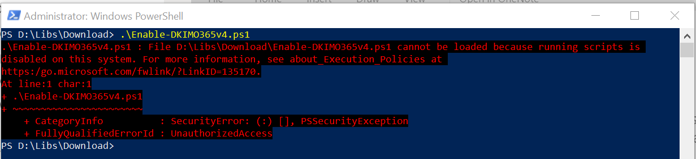

# Execution Policy

All windows systems from the windows server 2008 r2 (or windows 7) has integrated PowerShell in the systems, but count with a policy that allows only "signed" script to run safely on the computer. 

 
General all the scripts that we found over the internet doesn't count with a signature, which means that have been created for a 3rd person but another person or entity could have modified the original content. 
 

Finally run a PS Script 

 
 

  

Do you have any question? 

# How to get the Current Execution Policy 

To get the information about what is the one that you currently has in your computer run the following command: 

  

Get-ExecutionPolicy  

  

You can find more documentation here: https://docs.microsoft.com/en-us/powershell/module/microsoft.powershell.security/get-executionpolicy?view=powershell-5.0 

  

On powershell the "Get-"   are used to query, those cmdlets are not meant to change anything but check values. 

# How to modify the Execution Policy

For integrity, this step requires that you run PowerShell as administrator, here's how: https://www.youtube.com/watch?v=tY29YFgxo1k 

  

Also, run 

  

Set-ExecutionPolicy Unrestricted 

  

You'll get a prompt verifying the changes, 

Select the letter to accept it (according to the languages, for English would be "Y" and then enter, for Spanish would be "R" and enter) 

 
# Finally, How run a PS Script? 

 The Execution policy is some preparation to run the scripts, now the cheese part, to run the PowerShell script, that is not more than a text file with Cmdlets in it and with the extension ".ps1". Let's suppose that we want to run the script named: test.ps1 located at "D:\libs\desktop" 

  

There's two ways to do it: 

  

## Method 1: use relative path 

 

Navigate to the folder where the script lies using "cd <path>" 

ex: cd "D:\libs\desktop" 

TIP: In this case the "" are not mandatory because we have no spaces on the Path, but if we had it, it's mandatory to use double quotes at start and end to make sure that all is taken correctly 

Run the script  

.\test.ps1 

 

 

## Method 2: use absolute path 

Run the absolute path directly 

D:\libs\desktop\test.ps1 

 

 # Cmdlets on this Ward

 (Get-ExecutionPolicy)[https://docs.microsoft.com/en-us/powershell/module/microsoft.powershell.security/get-executionpolicy?]
 (Set-ExecutionPolicy)[https://docs.microsoft.com/en-us/powershell/module/microsoft.powershell.security/set-executionpolicy?view=powershell-5.1]

 

 ## Questions

 - What happends if you want to run an unsigned script when you don't change the execution policy?
  
 

